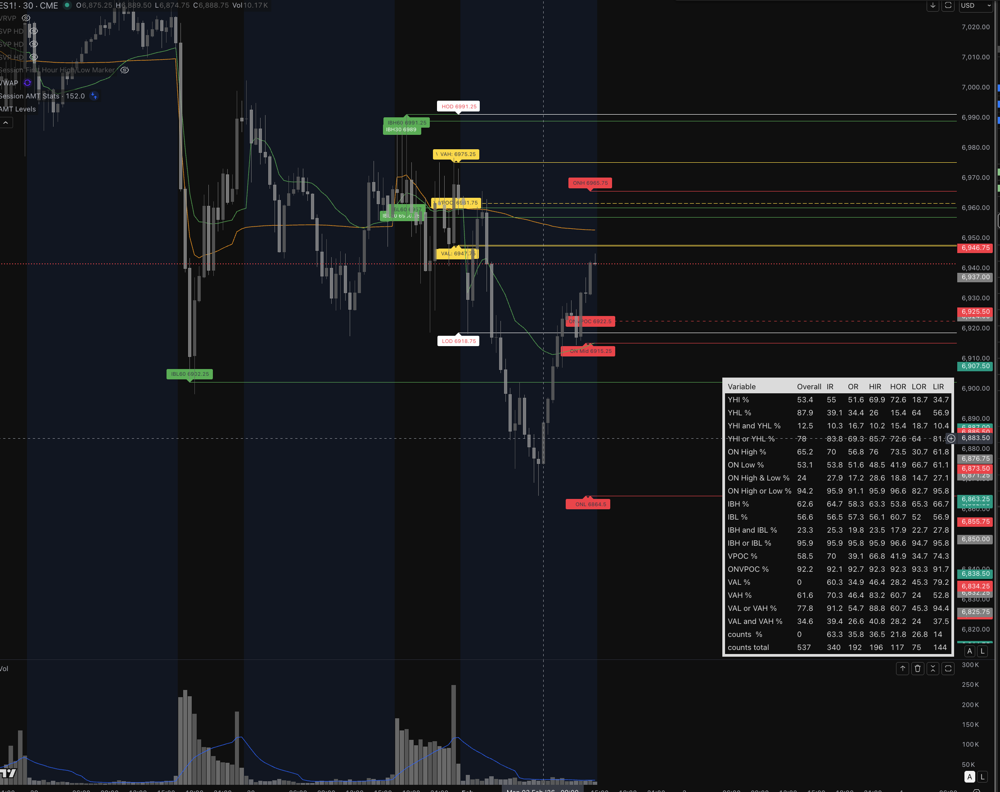

# Auction Market Theory Stats Strategy

TradingView Pine Script strategy for analyzing session-based Auction Market Theory (AMT) statistics. It computes session value area and VPOC levels, tracks breaks relative to reference sessions, and can optionally place strategy entries for backtesting.

## What it does

- Defines active, reference, and overnight sessions.
- Computes VPOC and value area from a session volume profile histogram.
- Tracks session break counts (e.g., VAH/VAL/VPOC, ONH/ONL, IB ranges).




## Layout

```
.
├── src/
│   └── auction_market_theory_stats_strategy.pine
└── README.md
```

## Usage

1. Open TradingView and create a new Pine Script strategy.
2. Paste the contents of [src/auction_market_theory_stats_strategy.pine](src/auction_market_theory_stats_strategy.pine).
3. Configure sessions and filters in the Inputs panel.
4. Run the strategy on an intraday chart (1min to 1h).


